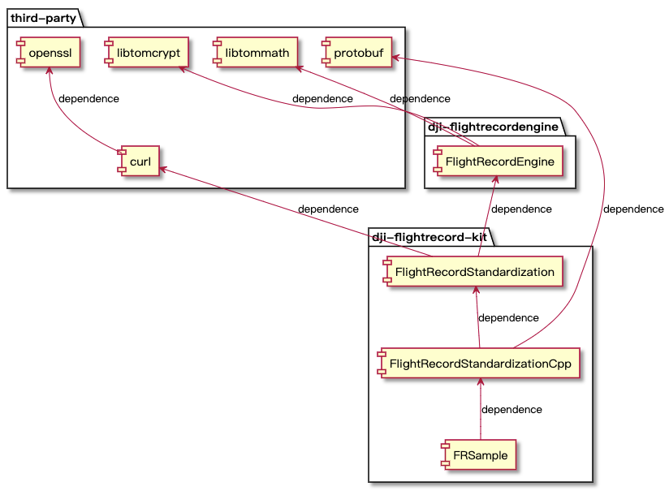

# DJIFlightRecord

### <p>[English Version](https://github.com/dji-sdk/FlightRecordParsingLib/blob/master/README.md)</p>

## 什么是 DJIFlightRecord？

飞行记录解析库是一款可以解析版本 13 飞行记录文件的应用程序。它将 DJI 协议数据转换为时间帧对象，用于展示和分析，运行飞行记录解析库需要申请 App Key。

## 如何申请我的 App Key？

1. 登录 [DJI 开发者平台](https://developer.dji.com/user)，点击"创建应用"，App Type 选择 "Open API"，自行填写“App 名称”“分类”和“描述”，点击 "创建"。

2. 通过个人邮箱激活 App，在开发者网平台个人点击查看对应 App 信息，其中 **App Key** 即为下文所需的 SDK 密钥参数。

## 该应用程序在哪里创建版本 13 的飞行记录日志？

使用 Mobile SDK 4.12 版本的应用程序

## 架构关系



* FRSample：用于介绍如何调用接口和解析数据
* FlightRecordStandardizationCpp：用于将 C++ 结构对象转换为 Protobuf 对象，以跨平台数据传输
* FlightRecordStandardization：用10 HZ 的频率记录原始数据，呈现飞机状态的视图模型
* FlightRecordEngine：用于将加密数据解析为明文数据
* libtomcrypt/libtommath：用于解密原始文档
* curl/openssl：用于与 DJIService 进行通信以获取解密密钥

### 文件夹结构

以下是文件目录的作用介绍：

* FR-V1.0.0/third-party/source：所依赖三方库的源文件的存放位置，具体的编译方法需要自行解决
* FR-V1.0.0/third-party/header：所依赖三方库的头文件的存放位置
* FR-V1.0.0/third-party/cmake：用于 CMake 编译自定义函数
* FR-V1.0.0/third-party/build：用于存放三方库的编译产物，仅支持在部分平台运行
* FR-V1.0.0/dji-flightrecord-engine/build： 用于存储 dji-flightrecordengine 库的每个平台的编译产物
* FR-V1.0.0/dji-flightrecord-engine/source：dji-flightrecordengine 库的源代码
* FR-V1.0.0/dji-flightrecord-kit/build：用于存储 dji-flightrecord-kit 库的每个平台的编译产物
* FR-V1.0.0/dji-flightrecord-kit/protoc：包含标准化数据结构的 Protobuf 文件，可用于跨平台数据传输
* FR-V1.0.0/dji-flightrecord-kit/source：dji-flightrecord-kit 库的源代码
* FR-V1.0.0/images：在 README 中引用的照片资源


## 如何运行示例代码？

### 在 Docker 上运行示例代码
**下载 Docker** 

https://docs.docker.com/get-docker

**创建 Docker 镜像**
```shell
docker build --build-arg SDK_KEY=your_app_key -t pf .
```

**运行 Docker**
```shell
docker run -v 宿主机目录:容器目录 pf "容器内的飞行记录文件路径"
```
命令示例：
docker run -v $(pwd):/tmp -it pf "/tmp/V132_DJIFlightRecord_2020-06-18_[19-01-24].txt" > json_result.json

"> json_result.json" 将运行结果重定向到指定文件中

### 在 Mac 上运行示例代码

以下是 Mac 版本的 Sample 运行创建过程

```shell
cd dji-flightrecord-kit/build/Mac/FRSample
sh generate.sh

// Which do you want to build? Please Input the number:
// 0: Executable 1: Project        input:
// input 1 can create a xcode project.
```

1. 打开 dji-flightrecord-kit/build/Mac/FRSample/FRSample.xcodeproj
2. 转到 main.cc 文件并将要解析的文件路径配置到变量 file_path 中
3. 配置 "startRequestParser" 接口的 SDK 密钥参数，即可解析版本为 Flight Record 13 的文件

### 在 Ubuntu 上运行示例代码

```shell
cd dji-flightrecord-kit/build/Ubuntu/FRSample
sh generate.sh
./FRSample
```

1. 转到 main.cc 文件并将要解析的文件路径配置到变量 file_path 中
2. 配置 "startRequestParser" 接口的 SDK 密钥参数，即可解析版本为 Flight Record 13 的文件
3. 运行上面的脚本

## 如何编译库？

### 在 Mac 上

```shell
cd dji-flightrecord-kit/build/Mac/FlightRecordStandardizationCpp
sh generate.sh
./FRSample
```

1. 运行上面的脚本
2. 获取你需要的库，header 文件存储在 dji-flightrecord-kit/source/FlightRecordStandardizationCpp/parser/DJIFRProtoParser.hpp 中

### 在 Ubuntu 上

```shell
cd dji-flightrecord-kit/build/Ubuntu/FlightRecordStandardizationCpp
sh generate.sh
./FRSample
```

1. 运行上面的脚本
2. 获取你需要的库，header 文件存储在 dji-flightrecord-kit/source/FlightRecordStandardizationCpp/parser/DJIFRProtoParser.hpp 中

## 主要贡献者

FlightRecord 由 [DJI SDK](https://developer.dji.com) 拥有和维护。

## 获得支持

期望获得更多定制数据，请让我们知道您的数据需求和应用场景。
您可以通过以下方法获得 DJI 的支持：

- [dev@dji.com](mailto:dev@dji.com)

## License

DJIFlightRecord 可在 MIT 许可下使用。有关更多信息，请参见 LICENSE.txt 文件。
